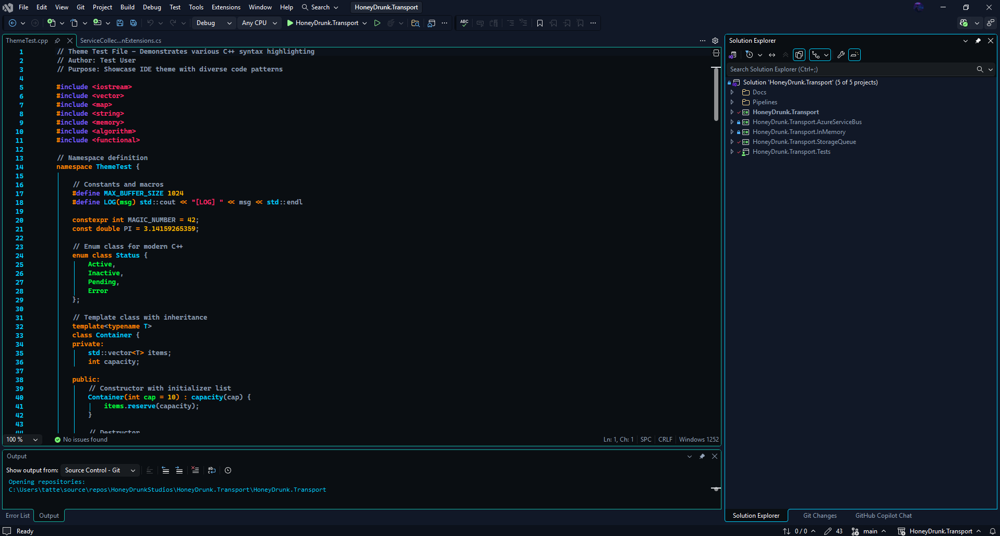
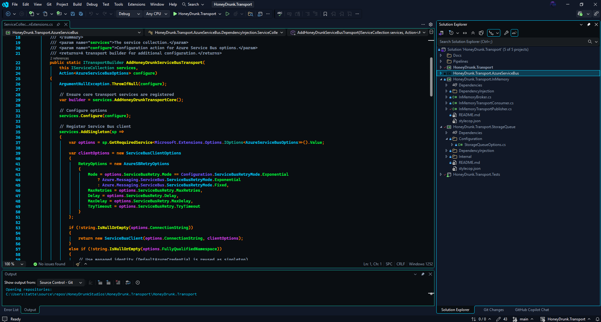

<div align="center">

# Honeypunk

**Cyberpunk-grade Visual Studio 2022/2026 theme builder** — declarative, semantic, palette-driven.

[](./) [](LICENSE) [](./) [](./)

</div>

Honeypunk provides a **YAML‑first pipeline** for authoring and packaging Visual Studio color themes. Define intent once, apply a semantic mapping, rebuild, ship.

## Features

- **Full Surface Coverage**: Environment chrome, editor glyphs, tool windows, semantic tokens, ReSharper classifications.
- **Palette Driven**: Central palette file (`docs/palette.md`) – edit once, propagate.
- **Semantic Remapping**: Role → color assignment (`tools/mappings.yaml`, `tools/roles.yaml`) applied via `apply_palette.py --semantic`.
- **Dry‑Run & Audit**: Preview foreground/background changes and unused palette colors with `--dry-run --report`.
- **Background Safety**: Flag-coded backgrounds (e.g. `05x00000000`) preserved.
- **Example Sources**: Reference layouts (`example/OneDarkPro2026.yaml`, `example/HoneyDrunkCyberpunk.json`).
- **Fast Packaging**: Build VSIX for 17.x through 2026 previews with one command.

## How It Flows

```text
Palette ➜ Roles ➜ Semantic Apply ➜ VSIX Build ➜ Install ➜ Iterate
```

1. Edit palette / roles.
2. Preview mapping.
3. Apply mapping.
4. Build & install.
5. Reselect theme in VS.

## Requirements

- Python 3.10 or newer (3.12+ recommended)
- PyYAML & ruamel.yaml (`python -m pip install pyyaml ruamel.yaml`)

## Quick Start

1. **Install dependencies**

```powershell
python -m pip install --upgrade pip
python -m pip install pyyaml
```

2. **Build the bundled Honeypunk theme**

```powershell
python build_vsix.py -i Honeypunk.yaml -o Honeypunk
```

3. **Install the VSIX**

   1. Double-click `Honeypunk.vsix`.
   2. Follow the Visual Studio extension installer prompts.
   3. Restart Visual Studio.
   4. Navigate to **Tools > Options > Environment > General > Color theme**.
   5. Select **Honeypunk** (or your custom build) from the dropdown.

## Repository Layout

- `Honeypunk.yaml` - shipping theme showcasing coverage and Honeydrunk palette.
- `build_vsix.py` - CLI packager that converts YAML into a VSIX.
- `tools/apply_palette.py` - helper that normalizes colors in the YAML to match `docs/palette.md`.
- `tools/mappings.yaml` - semantic role → classification keys mapping.
- `tools/roles.yaml` - semantic role → palette color (foreground/background) assignment.
- `docs/palette.md` - reference table describing every palette color and its intent.
- `example/OneDarkPro2026.yaml` - structural source used to ensure no sections are missing.
- `example/HoneyDrunkCyberpunk.json` - VS Code theme that inspired Honeypunk's mood.

## Theme Authoring

A minimal configuration looks like this:

```yaml
Name: Honeypunk
Identity: Honeypunk
Version: 1.0.0
GUID: aaaaaaaa-bbbb-cccc-dddd-eeeeeeeeeeee
BaseGUID: 1ded0138-47ce-435e-84ef-9ec1f439b749  # Dark base

Author: Your Name
Description: Cyberpunk-inspired Visual Studio theme
Tags: Dark, Cyberpunk, VS2026
Icon: optional-icon.png

Sections:
  Environment:
    GUID: 624ed9c3-bdfd-41fa-96c3-7c824ea32e3d
    Background: ["#0A0E12", null]
    WindowText: ["#E5E7EB", null]
  # ...additional sections
```

### Color Value Format

Each entry is a list of two values: `[background_or_state, foreground_or_text]`.

- Hex colors: `#RRGGBB` or `#RRGGBBAA` (alpha optional).
- Nulls: `null` reuses VS defaults.
- Flags: `FFx########` encodes Visual Studio mask flags (for bold, italic, transparent, etc.).

Common masks:

- `05x00000000` - transparent background while preserving the foreground.
- `02x00000001` - bold.
- `02x00000002` - italic.

## Build Your Own Theme

1. Copy the shipping YAML:

   ```powershell
   Copy-Item Honeypunk.yaml MyTheme.yaml
   ```

2. Update metadata (`Name`, `Identity`, `Author`, `Description`, `Tags`, `GUID`).
3. Tweak color entries section by section. `docs/palette.md` lists every palette color with guidance.
4. (Optional) To quickly apply palette changes after editing `docs/palette.md`:

   ```powershell
   python tools/apply_palette.py                # normalize only
   python tools/apply_palette.py --semantic     # apply semantic role colors
   python tools/apply_palette.py --semantic --dry-run --report  # preview & audit
   ```

   This normalizes all hex codes in `Honeypunk.yaml` to match your updated palette definitions.

5. Build your VSIX:

   ```powershell
   python build_vsix.py -i MyTheme.yaml -o MyTheme
   ```

6. Install and test within Visual Studio.

## Theme Sections

Every major Visual Studio surface has a dedicated section. Notable ones include:

- `Environment` - frame chrome, shell chrome, status bar, tabs.
- `Text Editor MEF Items` - margins, line numbers, indicators.
- `Text Editor Language Service Items` - syntax tokens for all languages.
- `Cpp Text Editor MEF Items` - overrides specific to C/C++.
- `Text Editor Text Marker Items` - bookmarks, errors, caret adornments.
- `CommonControls` / `CommonDocument` - dialogs, tree views, buttons, property grids.
- `Output Window`, `Find Results`, `Immediate Window`, `Command Window` - tool windows with their own defaults.

## Palette Reference

The condensed palette (see `docs/palette.md` for the full table):

| Name | Hex | Typical Usage |
| --- | --- | --- |
| Deep Space | `#0A0E12` | Application background, editor canvas |
| Gunmetal | `#111827` | Tool windows, inactive chrome |
| Electric Blue | `#00D1FF` | Accents, selections, file names, output text |
| Synth Magenta | `#D946EF` | Keywords, critical diagnostics |
| Neon Pink | `#FF2A6D` | Strings, highlighted glyphs |
| Aurum Gold | `#F5B700` | Numeric literals, badges |
| Matrix Green | `#00FF41` | C++ literals/punctuation, success cues |
| Slate Light | `#94A3B8` | Comments, XML docs, panel text, inactive UI |

Stay within this palette to keep the theme cohesive and on‑brand.

## Semantic Mapping & Automation

The semantic system lets you change *roles* instead of hunting individual classification keys.

Core files:
- `tools/mappings.yaml` groups Visual Studio classification keys under roles (e.g. `variables`, `functions`, `types`).
- `tools/roles.yaml` assigns palette color names (and optional backgrounds) to each role.

Workflow:
```powershell
# Preview planned foreground/background changes
python tools/apply_palette.py --semantic --dry-run --report

# Apply semantic mapping
python tools/apply_palette.py --semantic --report

# Rebuild VSIX
python build_vsix.py -i Honeypunk.yaml -o Honeypunk
```

To retheme (example: make functions Chrome Teal):
1. Edit `tools/roles.yaml` → `functions: Chrome Teal` (or `fg: Chrome Teal`).
2. Run semantic apply & rebuild.
3. Reselect the theme in Visual Studio.

Background application only touches existing plain hex backgrounds; flag-coded entries are preserved. Dry‑run reporting audits unused palette colors and warns about overlapping classification keys.

### Current Role Assignments

| Role | Foreground | Background | Notes |
|------|------------|------------|-------|
| variables | Synth Magenta | Deep Space | C# locals & fields, C++ globals/locals |
| functions | Neon Yellow | Deep Space | C# methods & extension methods; C++ free/member/static/template |
| control_keywords | Cyber Orange | (inherit) | `if`, `else`, `await`, `throw`, C++ control flow |
| base_keywords | Synth Magenta | (inherit) | Non‑control keywords |
| types | Chrome Teal | Gunmetal | Classes, structs, interfaces, enums, delegates |
| parameters | Matrix Green | (inherit) | C#/C++ parameters |
| strings | Neon Pink | (inherit) | String & verbatim literals |
| comments | Slate Light | Gunmetal | Code & XML doc comments |
| literals | Aurum Gold | (inherit) | Numeric & UDL number/raw tokens |
| errors | Synth Magenta | Deep Space | Error + breakpoint emphasis |
| preprocessor | Violet Flux | (inherit) | C#/C++ preprocessor directives |
| namespaces | Violet Flux | (inherit) | Namespace identifiers |

Edit the table by changing values in `tools/roles.yaml` then re‑run semantic apply.

## Screenshots

| C++ (Identifiers & Operators) | C# (Control Flow & Methods) |
| ------------------------------ | --------------------------- |
|  |  |

## Troubleshooting

**Theme not listed after install**
- Restart Visual Studio after installing the VSIX.
- Ensure each theme has a unique GUID and Identity.
- Verify the VSIX appears under **Extensions > Manage Extensions**.

**Unexpected colors**
- Confirm every entry uses valid `#RRGGBB` or `#RRGGBBAA` values.
- Check that each section retains its `GUID` from the upstream layout.
- Remember that some surfaces read both slots of the `[background, foreground]` pair.

**Build failures**
- Validate YAML syntax (indentation, quotes, lists).
- Make sure `Name`, `Identity`, `Version`, `GUID`, `BaseGUID`, and `Sections` exist.
- Confirm any icon referenced by `Icon:` is present in the same directory.

## Contributing

Please open issues for:
- Missing classification coverage
- Palette expansion proposals
- Performance or packaging improvements
- Additional sample themes

Issues and pull requests are welcome—share palette tweaks, new sample themes, or builder improvements.

## Roadmap

- VS 2026 theming delta tracking
- Optional JSON output for semantic apply report
- Background gradient experimentation (if VS permits)
- Live preview script for rapid iteration

## License

This project is distributed under the MIT License (see `LICENSE`).

## Acknowledgments

- Inspired by the Visual Studio theming community and the Cyberpunk/One Dark Pro themes.
- Honeydrunk palette design documented in `docs/palette.md`.